# praktikum_16_tsa

A new Flutter project.

## Getting Started

This project is a starting point for a Flutter application.

## Screenshot 1

It's a counter app default by Flutter

Penjelasan: Aplikasi awal bawaan New Project dari Flutter yaitu counter app dimana counter akan bertambah ketika kita melakukan onPressed pada tombol tambah

## Screenshot 2

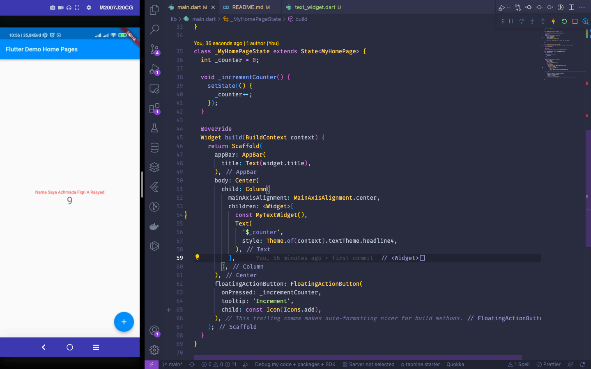

Penjelasan: Mengubah Text Widget sebelumnya menjadi nama kita secara statis

## Screenshot 3

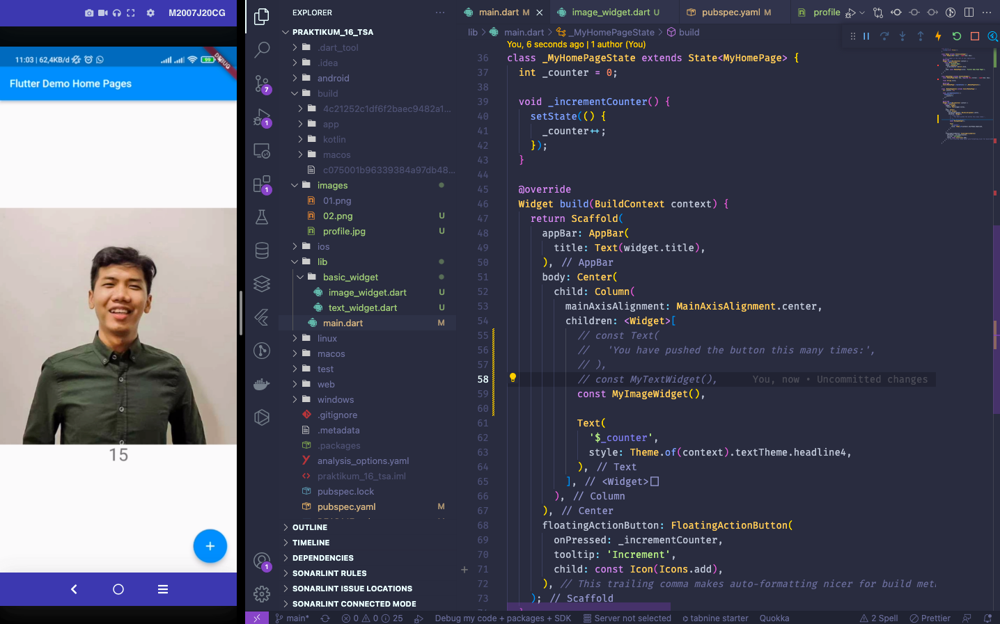

Penjelasan: Mengubah Text Widget menjadi gambar

## Screenshot 4

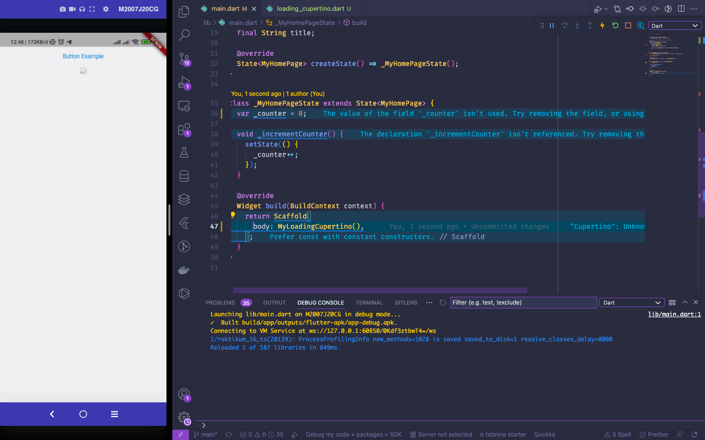

Penjelasan: Menampilkan loading

## Screenshot 5

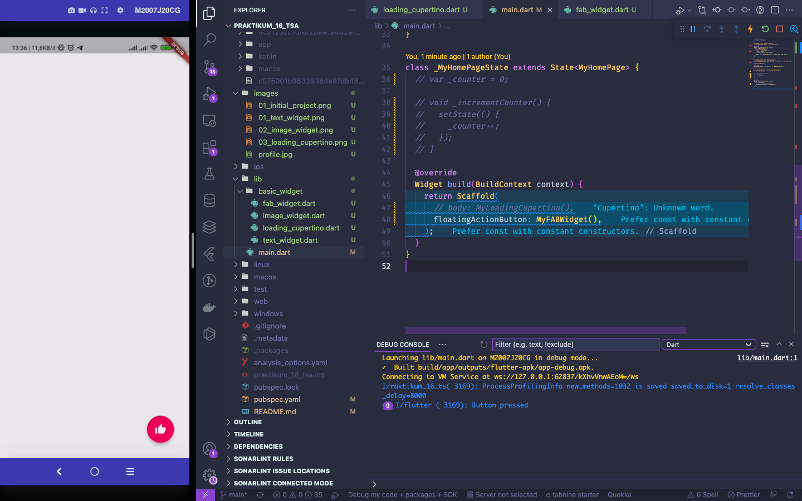

Penjelasan: Membuat Floating Button pada Flutter

## Screenshot 6

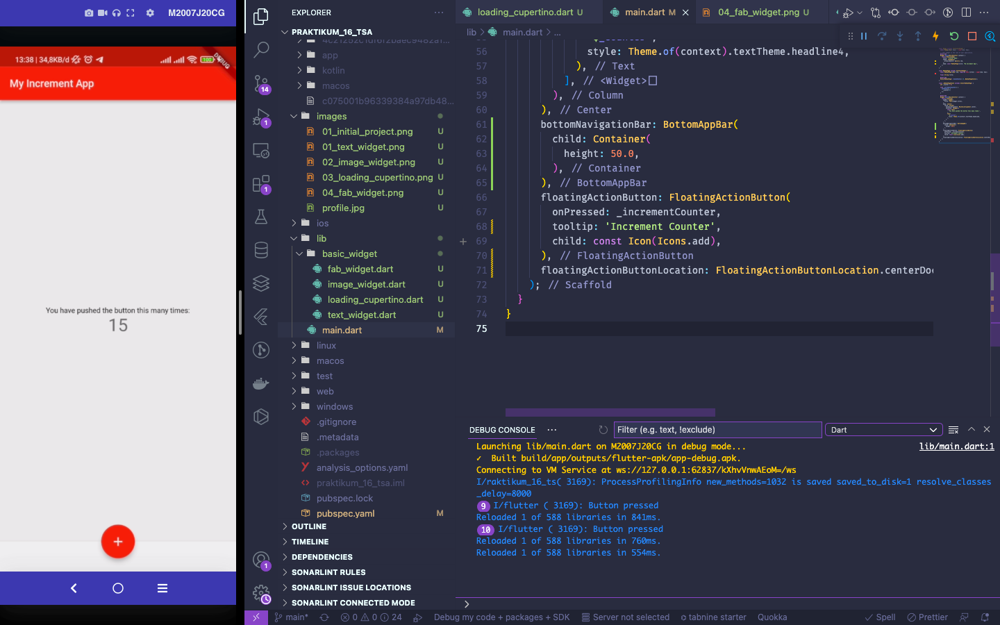

Penjelasan: Membuat Scaffold Widget pada Flutter

## Screenshot 7
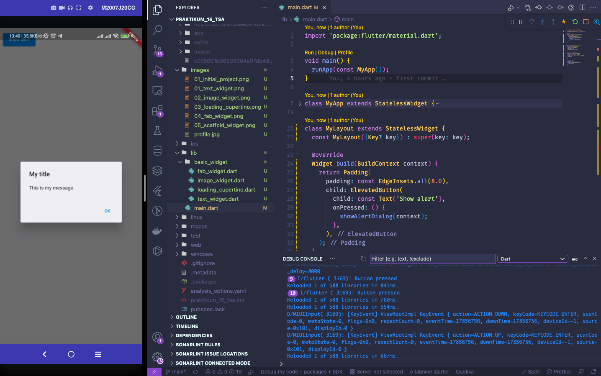

Penjelasan: Membuat Dialog Widget pada Flutter agar bisa menampilkan pesan pop up atau alert

## Screenshot 8

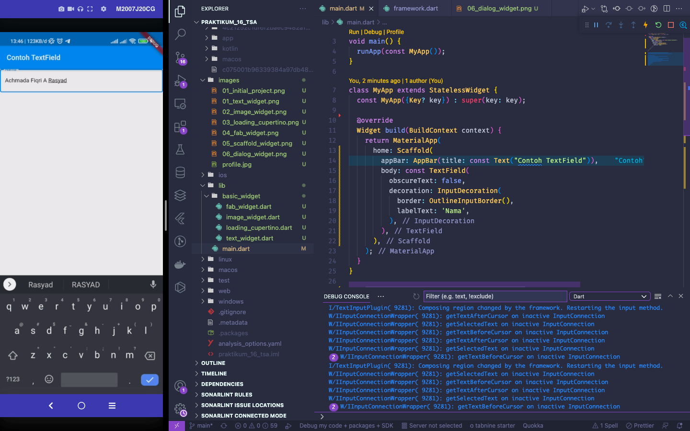

Penjelasan: Membuat Input and Selection Widget pada Flutter agar melakukan input data nama

## Screenshot 9

Penjelasan: Membuat Date and Time Picker pada Flutter untuk melakukan input tanggal

## Screenshot 10

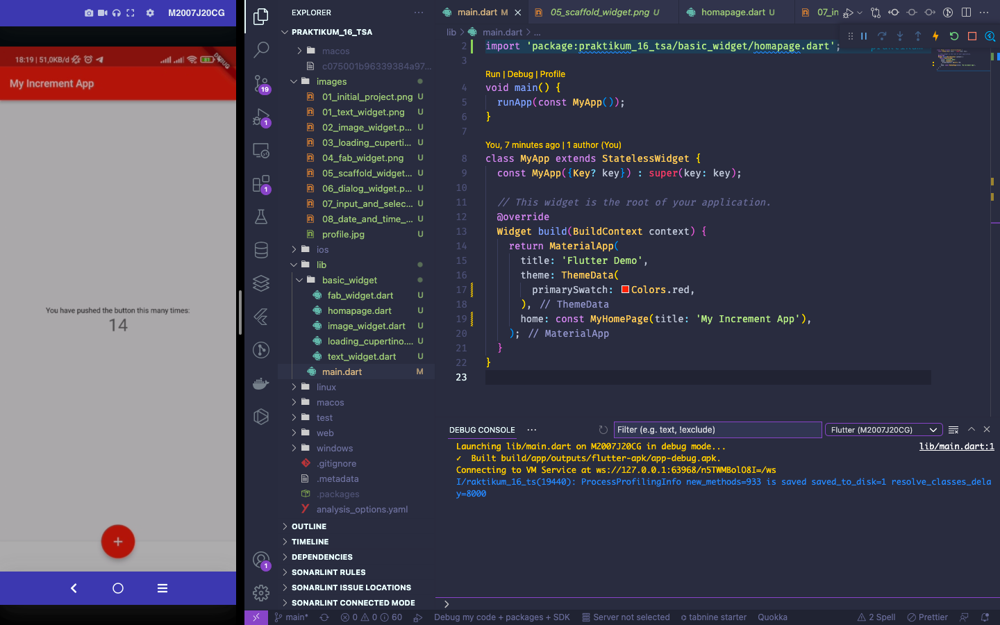

## Screenshot 11 

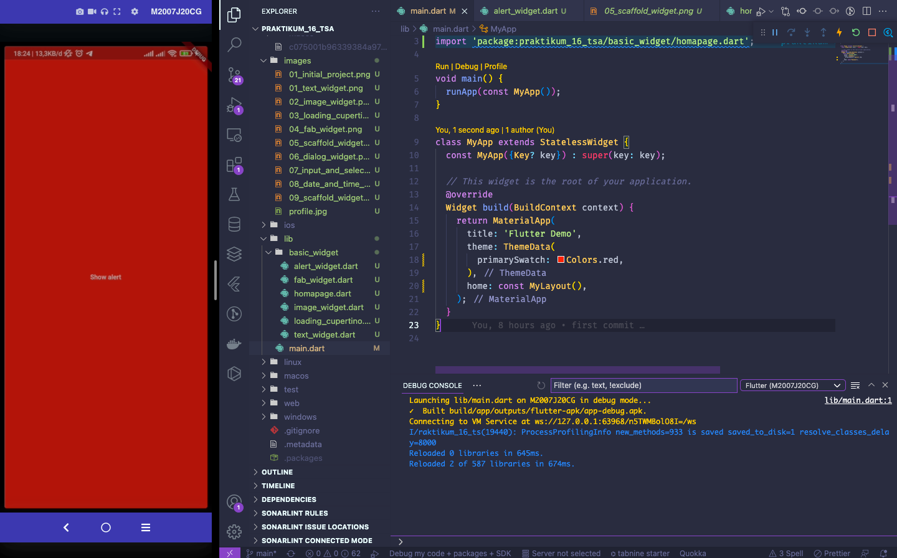

## Screenshot 12

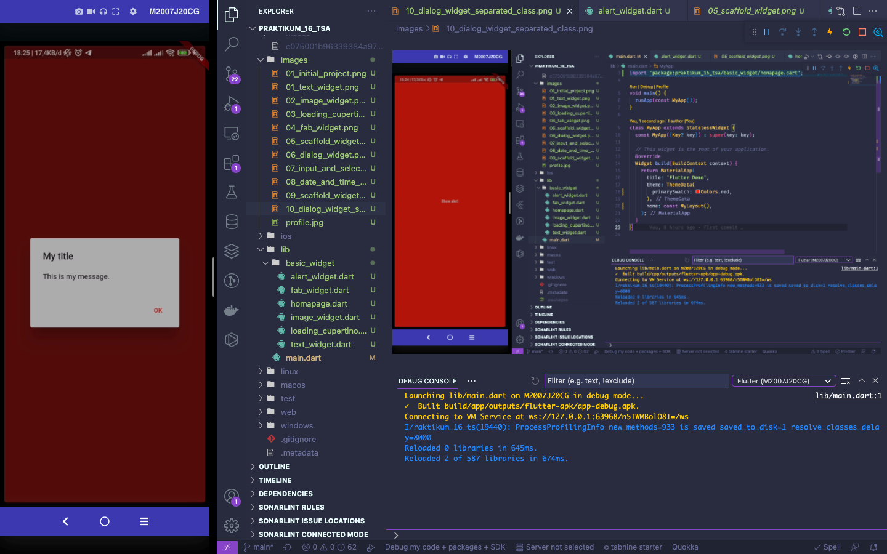

## Screenshot 13

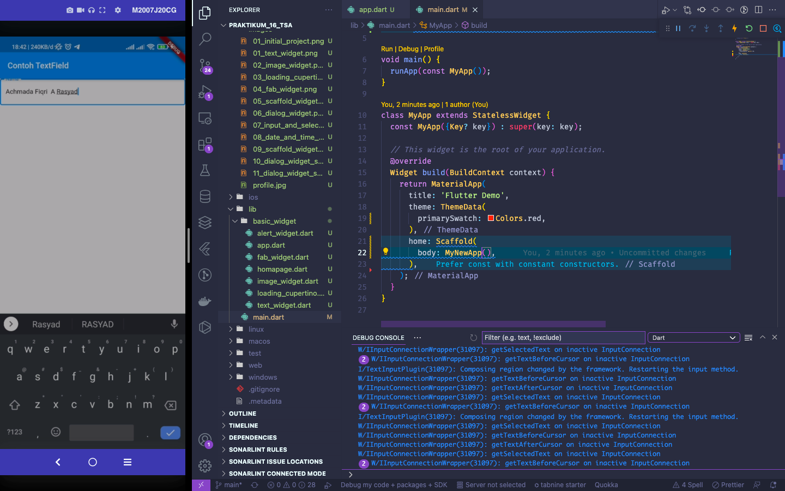

## Screenshot 14

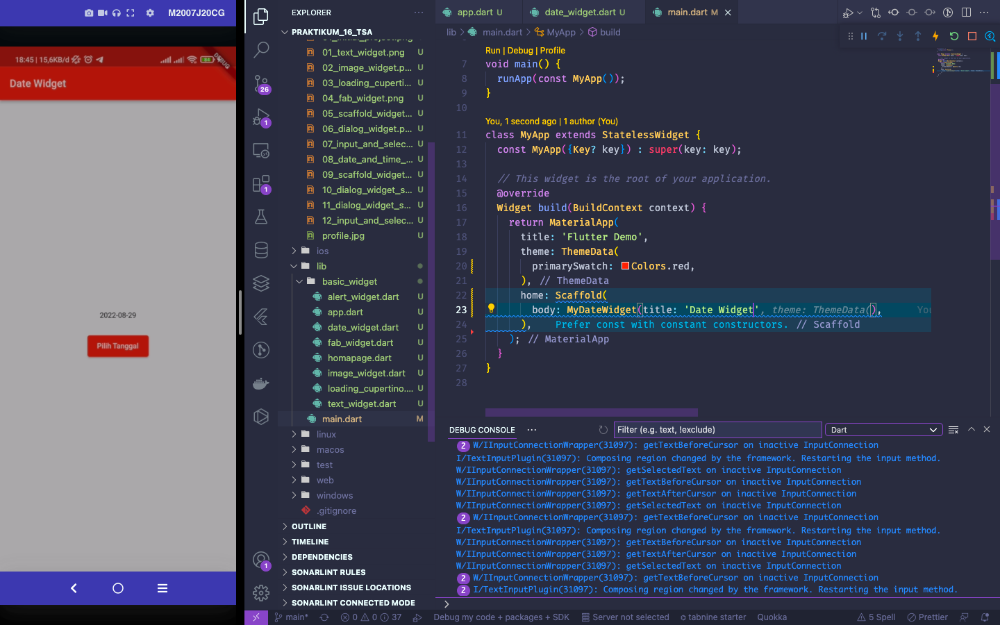

## Text Widget

## Image Widget